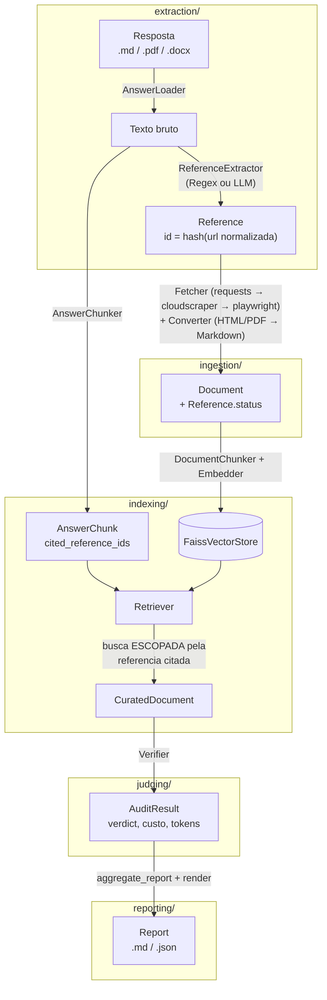

# Deep Research Auditor

Framework para auditar automaticamente se as respostas produzidas por
ferramentas de Deep Research (ChatGPT, Gemini, Perplexity, etc.) sao
realmente suportadas pelas referencias que elas citam.

O pipeline extrai as referencias citadas numa resposta, baixa e converte
o conteudo citado, indexa esse conteudo, usa um LLM como juiz para
classificar cada trecho da resposta como suportado/nao suportado/
contraditado pelo contexto recuperado, e agrega tudo num relatorio final.

## Arquitetura

### Pipeline



Cada seta é uma função que recebe/devolve um modelo Pydantic — nunca um
path de arquivo ou uma posição de lista como contrato implícito.
`pipeline.py` orquestra os cinco estágios sobre esse contrato,
persistindo cada etapa em `data/runs/<run_id>/` para permitir retomada
(`audit resume`).

### Estrutura de diretórios

```
src/auditframework/
├── cli.py             # audit run/resume/report/compare (Command)
├── pipeline.py         # Pipeline + RunContext + 5 stages (DI)
├── config.py           # Settings unico (pydantic-settings)
├── logging_config.py
├── models/             # contrato compartilhado (Pydantic)
│   ├── reference.py    # Reference, ReferenceStatus
│   ├── document.py     # Document
│   ├── chunk.py        # AnswerChunk, ReferenceChunk
│   ├── curated.py      # RetrievedPassage, CuratedDocument
│   ├── audit_result.py # AuditVerdict, AuditResult, SkippedChunk
│   └── report.py       # Report, JudgeConfig, ReferenceStats, ToolStats
├── extraction/         # resposta -> Reference (extracao de citacoes)
├── ingestion/          # Reference -> Document (download + conversao)
├── indexing/           # chunking de documentos, embeddings, FAISS, retrieval
├── judging/            # juiz LLM
├── reporting/          # agregacao + render do relatorio final
└── common/             # erros tipados, LLMClient compartilhado, pricing
```

### Padrões de projeto aplicados

- **Command** — `cli.py`: `run`/`resume`/`report`/`compare` como subcomandos independentes (Typer).
- **Pipeline + Dependency Injection** — `pipeline.py`: cada estágio recebe
  suas dependências (Embedder, LLMClient, Fetcher) via construtor;
  `build_pipeline()` resolve os adapters reais a partir do `Settings`.
- **Strategy** — `AnswerLoader` (md/pdf/docx), `ReferenceExtractionStrategy`
  (Regex ou LLM), `Fetcher`/conversores, `Embedder`/`VectorStore`/`LLMClient`.
- **Adapter** — `FaissVectorStore` (sobre `faiss`), `BGEEmbedder`/`Reranker`
  (sobre `sentence-transformers`), `OpenAICompatibleClient`/`AnthropicClient`
  (sobre os SDKs de LLM).
- **Repository** — `ReferenceRegistry` (persistência idempotente de
  `Reference`/`Document`).
- **Builder** — `ReportRenderer` (monta Markdown/JSON a partir do `Report`);
  `Retriever._assemble_context` (monta o contexto curado preservando
  proveniência por trecho).
- **Chain of Responsibility** — `HttpFetcher`: `requests` → `cloudscraper`
  → `playwright`.
- **Factory** — `create_llm_client(settings)`, `build_pipeline(settings)`.
- **Erros tipados** — hierarquia em `common/errors.py`
  (`DeadReferenceError`, `InaccessibleReferenceError`, `LLMParseError`,
  `LLMProviderError`, ...), cada situação de falha vira um tipo explícito
  em vez de casamento de substring em texto de erro livre.

### Contrato de dados (resumo)

`Reference` (id estável por hash de URL) → `Document` (conteúdo baixado)
→ `AnswerChunk`/`ReferenceChunk` (chunking) → `CuratedDocument` (contexto
recuperado e escopado — ou `skip_reason` setado quando não há evidência
citada disponível, ver `--full-corpus` abaixo) → `AuditResult` (veredito do
juiz — apenas `SUPPORTED`/`UNSUPPORTED`/`CONTRADICTED`; uma falha de
parsing da saída do LLM juiz nunca é coagida silenciosamente para um
desses vereditos — o chunk é pulado com um aviso e fica pendente para uma
próxima `audit resume`, sem derrubar o restante do run) / `SkippedChunk`
(chunk não julgado por falta de evidência citada, com justificativa) →
`Report` (agregação final, incluindo o `JudgeConfig` — modelo/provider/
parâmetros do LLM juiz usados na run). Definições completas em
`src/auditframework/models/`.

## Instalacao (desenvolvimento)

```bash
python3 -m venv .venv
source .venv/bin/activate
pip install -e ".[dev,ingestion,indexing,judging]"
python -m playwright install chromium  # necessario apenas para o fallback de scraping
cp .env.example .env
```

Os extras podem ser instalados seletivamente conforme o uso pretendido:

| Extra | O que habilita | Dependencias principais |
|---|---|---|
| `ingestion` | download/conversao de referencias (PDF, DOCX, scraping) | `requests`, `cloudscraper`, `playwright`, `trafilatura`, `pymupdf4llm`, `python-docx` |
| `indexing` | embeddings, reranking e indice FAISS | `sentence-transformers`, `faiss-cpu`, `semantic-text-splitter`, `tiktoken` |
| `judging` | juiz LLM (local/OpenAI/Anthropic) | `openai`, `anthropic` |
| `dev` | rodar a suite de testes | `pytest`, `pytest-cov` |

## Uso

Toda configuração (provider de LLM, modelos de embedding/reranking,
diretórios, top-k de recuperação, retries/timeout) é feita via `.env` —
ver `.env.example` para a lista completa e comentada de variáveis.

### `audit run` — executa o pipeline completo

```bash
audit run RESPOSTA [--tool NOME_DA_FERRAMENTA] [--full-corpus]
```

- `RESPOSTA` (obrigatório): caminho para o arquivo de resposta a ser
  auditado (ver formatos suportados abaixo).
- `--tool` (opcional, padrão `unknown`): nome da ferramenta de Deep
  Research que gerou a resposta (`ChatGPT`, `Gemini`, `Perplexity`, ...)
  — usado como metadado no relatório final, não afeta o processamento.
- `--full-corpus` (opcional, padrão desligado): controla como o
  `CuratedDocument` de cada chunk é montado.
  - **Desligado (padrão)**: a busca é escopada só pelas referências que o
    chunk efetivamente cita. Se o chunk não cita nenhuma referência, ou a
    referência citada não pôde ser baixada (morta/inacessível), esse
    chunk **não é julgado** — fica registrado em `skipped_chunks.jsonl`
    com uma justificativa, contabilizado no relatório (`SKIPPED`), e o
    resto da auditoria continua normalmente.
  - **Ligado**: ignora a citação e monta o contexto buscando no corpus
    inteiro (reflete que um Deep Research tipicamente usa todo o
    conhecimento que encontrou, não só o que citou explicitamente) —
    nesse modo nenhum chunk é pulado por falta de evidência citada.

  A flag é fixada para toda a execução (persistida em
  `run_meta.json`) — `audit resume` sempre usa o mesmo modo com que a run
  começou, sem precisar (nem poder) ser passada de novo.

Roda extraction → ingestion → indexing → judging → reporting e persiste
tudo em `data/runs/<run_id>/` (`run_id` derivado deterministicamente do
conteúdo do arquivo de entrada + timestamp).

```bash
audit run respostas/gemini_direito.md --tool Gemini
```

### `audit resume` — retoma uma execução interrompida

```bash
audit resume RUN_ID
```

Retoma a partir do último estágio concluído — útil após uma interrupção
(crash, timeout do provedor de LLM, queda de conectividade). Estágios já
persistidos (`extraction`, `ingestion`, `indexing`) são pulados por
inteiro; dentro do estágio de julgamento, cada chunk que já tem um
`AuditResult` persistido em `audit_results.jsonl` também é pulado
individualmente — nenhum trabalho já feito é refeito.

```bash
audit resume gemini_direito_a1b2c3_20260801T120000Z
```

### `audit report` — reimprime um relatório já gerado

```bash
audit report RUN_ID
```

Imprime no terminal o `report.md` de uma execução já concluída, sem
reprocessar nada. Falha com uma mensagem clara (sugerindo `audit
resume`) se a execução ainda não chegou ao estágio de reporting.

### `audit compare` — compara múltiplas execuções

```bash
audit compare RUN_ID [RUN_ID ...]
```

Compara, lado a lado, o percentual de SUPPORTED/UNSUPPORTED/
CONTRADICTED de duas ou mais execuções já
julgadas — útil para comparar respostas de ferramentas diferentes sobre
o mesmo tema, ou a mesma resposta auditada por LLMs juízes diferentes.

```bash
audit compare chatgpt_direito_a1b2c3_... gemini_direito_d4e5f6_...
```

### Formatos de arquivo de entrada suportados

| Formato | Extensões | Requisito |
|---|---|---|
| Markdown | `.md`, `.markdown` | nenhum (instalação base) |
| PDF | `.pdf` | extra `[ingestion]` (via `pymupdf4llm`) |
| Word | `.docx` | extra `[ingestion]` (via `python-docx`) |

A resposta de entrada precisa conter, ao final, uma lista de referências
no formato tipicamente produzido por ChatGPT/Gemini/Perplexity
(marcadores `[N]` seguidos de título e URL, na mesma linha ou na
seguinte) para que a extração padrão por regex (`RegexReferenceExtractor`)
funcione. Para respostas cuja lista de fontes não segue esse formato,
existe `LLMReferenceExtractor` (`extraction/reference_extractor.py`),
que usa o mesmo `LLMClient` do estágio de julgamento — hoje disponível
para uso programático (`Pipeline`/`ExtractionStage` aceitam qualquer
`ReferenceExtractionStrategy` via construtor), sem uma flag de CLI
dedicada ainda.

## Relatório final

Cada run gera, em `data/runs/<run_id>/`, `report.md` (legível) e
`report.json` (mesmos dados, para consumo programático). Seções do
`report.md`:

1. **Metadados da Execução** — run id, ferramenta, tempo de
   processamento e o modelo/provider/parâmetros (`temperature`,
   `max_retries`, `retry_delay`, `base_url` quando aplicável) do LLM
   juiz usado nessa run — persistido para consulta posterior, mesmo que
   a configuração (`.env`) mude depois.
2. **Distribuição de Vereditos** — contagem e percentual de
   SUPPORTED/UNSUPPORTED/CONTRADICTED (e SKIPPED, quando houver).
3. **Custo e Uso de Tokens** — custo total estimado, tokens totais e
   médias por requisição ao juiz.
4. **Análise por Referência** — tabela por referência citada (status,
   número de citações, distribuição de veredito), incluindo quantas e
   qual percentual das referências extraídas não foram citadas por
   nenhum chunk julgado.
5. **Referências Mortas e Inacessíveis** — referências com HTTP 404 ou
   inacessíveis (403/timeout/SSL) após esgotar as estratégias de fetch.
6. **Exemplos Representativos por Veredito** — até 3 exemplos por
   veredito, com o trecho da resposta e a justificativa do juiz.
7. **Chunks Não Auditados** — chunks pulados (sem evidência citada
   disponível) e o motivo.

## Testes

```bash
pytest
```
