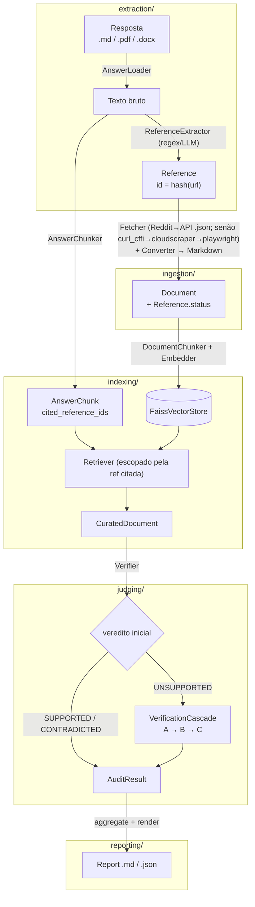

# Deep Research Auditor

Framework que audita automaticamente se as respostas de ferramentas de Deep
Research (ChatGPT, Gemini, Perplexity, ...) são sustentadas pelas referências
que citam.

Para cada trecho da resposta, o pipeline recupera o conteúdo da referência
citada e usa um LLM como juiz para classificá-lo em **SUPPORTED**,
**UNSUPPORTED** ou **CONTRADICTED**. Trechos julgados `UNSUPPORTED` passam por
uma cascata de verificação (ver [Auditoria de vereditos UNSUPPORTED](#auditoria-de-vereditos-unsupported)).
O resultado é um relatório `.md` + `.json`.

## Pipeline


```mermaid
flowchart TD
    IN["Resposta<br/>.md / .pdf / .docx"]

    subgraph EXT["extraction/"]
        IN -->|AnswerLoader| TXT["Texto bruto"]
        TXT -->|"ReferenceExtractor (regex/LLM)"| REF["Reference<br/>id = hash(url)"]
    end

    subgraph ING["ingestion/"]
        REF -->|"Fetcher (Reddit→API .json; senão curl_cffi→cloudscraper→playwright)<br/>+ Converter → Markdown"| DOC["Document<br/>+ Reference.status"]
    end

    subgraph IDX["indexing/"]
        TXT -->|AnswerChunker| CHK["AnswerChunk<br/>cited_reference_ids"]
        DOC -->|"DocumentChunker + Embedder"| VS[("FaissVectorStore")]
        CHK --> RET["Retriever (escopado pela ref citada)"]
        VS --> RET
        RET --> CUR["CuratedDocument"]
    end

    subgraph JUD["judging/"]
        CUR -->|Verifier| V0{"veredito inicial"}
        V0 -->|"SUPPORTED / CONTRADICTED"| RES["AuditResult"]
        V0 -->|UNSUPPORTED| CASC["VerificationCascade<br/>A → B → C"]
        CASC --> RES
    end

    subgraph REP["reporting/"]
        RES -->|"aggregate + render"| OUT["Report .md / .json"]
    end
```

Cada seta é uma função que recebe/devolve um modelo Pydantic — nunca um path ou
posição de lista como contrato implícito. `pipeline.py` orquestra os 5 estágios
e persiste cada etapa em `data/runs/<run_id>/`, permitindo retomada por
`audit resume`.

## Instalação

```bash
python3 -m venv .venv && source .venv/bin/activate
pip install -e ".[dev,ingestion,indexing,judging]"
python -m playwright install chromium   # fallback de scraping
cp .env.example .env
```

Extras instaláveis seletivamente: `ingestion` (download/conversão de
referências), `indexing` (embeddings + reranking + FAISS), `judging` (juiz
LLM local/OpenAI/Anthropic), `dev` (testes).

## Configuração

Tudo via `.env` — ver `.env.example` para a lista completa e comentada.
Principais variáveis:

| Variável | Padrão | Função |
|---|---|---|
| `LLM_PROVIDER` | `local` | `local` / `openai` / `anthropic` / `ollama` |
| `LLM_MODEL`, `LLM_BASE_URL` | — | modelo e endpoint do juiz (e da extração via LLM) |
| `EMBEDDING_MODEL` | `BAAI/bge-m3` | modelo de embeddings |
| `RERANKER_MODEL` | `BAAI/bge-reranker-v2-m3` | cross-encoder de reranking |
| `RETRIEVAL_TOP_K` / `RERANK_TOP_K` | `30` / `10` | candidatos recuperados / reordenados (o rerank define quantas passagens o juiz vê) |
| `VERIFICATION_*` | — | parâmetros da cascata de UNSUPPORTED (ver abaixo) |

Um juiz pequeno demais (nome sugere < ~8B, ex: `gemma-4-e4b`) para contextos
longos de evidência gera vereditos grosseiros — o `audit run` emite um aviso
nesse caso.

## Uso

| Comando | O que faz |
|---|---|
| `audit run RESPOSTA [--tool NOME]` | roda o pipeline completo |
| `audit resume RUN_ID` | retoma do último estágio/chunk concluído |
| `audit report RUN_ID` | reimprime o `report.md` de uma run concluída |
| `audit compare RUN_ID [RUN_ID ...]` | compara o % de vereditos entre execuções |

`--tool` (padrão `unknown`) é apenas metadado do relatório. O `run_id` é
derivado deterministicamente do hash do conteúdo do arquivo + timestamp.
`audit resume` pula por inteiro estágios já persistidos e, dentro do
julgamento, pula chunk a chunk os que já têm resultado — nada é refeito.

### Formatos de entrada

`.md` / `.markdown` (instalação base); `.pdf` e `.docx` (extra `[ingestion]`).
O arquivo é normalizado para markdown e precisa:

1. **citar as fontes no corpo** com marcadores `[N]` (superscript em `.docx` e
   `<sup>N</sup>`/`[cite: N]` são convertidos automaticamente para `[N]`);
2. **terminar com uma lista de referências**.

Tabelas markdown no corpo (comuns em respostas do Gemini) são linearizadas
antes do chunking — cada linha vira `célula — célula` — para não fragmentar a
citação de cada célula num trecho ilegível.

`RegexReferenceExtractor` reconhece, em ordem: marcador `[N] título` + URL
(ChatGPT/Gemini), lista numerada após o separador `⁂` ou o cabeçalho da seção
de fontes (Perplexity/Gemini), e lista sem marcação nenhuma (marcador inferido
pela ordem de ocorrência, comum em `.docx`). Para respostas fora desses
formatos existe `LLMReferenceExtractor` (uso programático).

## Recuperação de contexto e julgamento inicial

Antes de qualquer verificação, cada `AnswerChunk` passa pelo **julgamento
inicial** (o *baseline*), em duas fases:

1. **Recuperação (busca vetorial + rerank), sem LLM.** A busca é **sempre
   escopada às referências que o chunk cita** — o texto do chunk é embutido
   (`bge-m3`) e a busca no FAISS é restrita aos trechos das referências citadas.
   O FAISS devolve `RETRIEVAL_TOP_K` (30) candidatos; o cross-encoder
   (`bge-reranker-v2-m3`) reordena e mantém os `RERANK_TOP_K` (10) melhores.
   Esses 10 trechos, ordenados por score e com cabeçalho de proveniência
   (`[referencia=… score=…]`), formam o `CuratedDocument` — o contexto que o
   juiz vê. Se o chunk não cita nenhuma referência, ou a referência citada não
   pôde ser baixada (morta/inacessível), não há o que recuperar: o chunk **não
   é julgado**, vira `SKIPPED` no relatório e a auditoria continua.
2. **Julgamento (1 chamada de LLM por chunk), serial.** O juiz recebe o texto do
   chunk + o `CuratedDocument` e devolve o veredito do chunk (`SUPPORTED` /
   `UNSUPPORTED` / `CONTRADICTED`), a justificativa, os trechos literais que o
   embasam, `unsupported_aspects` e — para **cada** referência citada
   individualmente — como aquela fonte se relaciona com a afirmação
   (`per_reference`: `supports` / `partial` / `absent` / `contradicts` + trecho
   literal). O veredito do chunk continua 3-classe; `per_reference` só o
   detalha. Uma saída não parseável não vira veredito — o chunk fica pendente
   para a próxima `audit resume`.

`SUPPORTED` e `CONTRADICTED` do baseline são finais. Um **`UNSUPPORTED` não é**
— ele entra na cascata abaixo. A busca no corpus inteiro (ignorando a citação)
acontece só na Etapa C.

## Auditoria de vereditos UNSUPPORTED

Um `UNSUPPORTED` do julgamento inicial **não é o veredito final**. Todo chunk
marcado `UNSUPPORTED` passa por uma cascata de 3 etapas
(`judging/verification/`), **sempre ativa**, que **para na primeira etapa que
muda o veredito**.

**A — Expansão de contexto (*small-to-big* na referência citada).** O baseline
julgou o chunk vendo só os 10 fragmentos de ~512 tokens mais bem pontuados,
isolados uns dos outros. Um fato pode ter escapado disso: ficou partido na
fronteira de dois fragmentos, ou ficou na posição 11–20 do ranking, ou só faz
sentido junto da frase anterior/seguinte. A Etapa A refaz a recuperação **na
mesma referência citada** corrigindo esses três pontos:

- amplia a janela de rerank de `RERANK_TOP_K` (10) para
  `VERIFICATION_RERANK_TOP_K` (20) — o dobro de trechos candidatos;
- garante que todo trecho da referência citada entre como candidato da busca
  (não só os 30 do `RETRIEVAL_TOP_K`);
- expande cada trecho sobrevivente com os `VERIFICATION_NEIGHBOR_WINDOW` (1)
  trechos imediatamente vizinhos no mesmo documento (o *big* do *small-to-big*);
- remonta o contexto em **ordem de documento** (não por score) e **funde os
  trechos contíguos num único bloco contínuo, removendo a sobreposição de texto
  repetida entre eles** (o `overlap` do chunker) — regiões distintas do
  documento continuam separadas por `---`. O juiz lê cada passagem como texto
  corrido, sem frases duplicadas inflando o prompt.

Com esse contexto ampliado e contínuo, o **mesmo juiz** re-julga o chunk. Se
achar suporte → `SUPPORTED` e a cascata para; se contradição → `CONTRADICTED`;
se continuar sem evidência → segue para a Etapa B.

**B — Varredura do documento citado inteiro.** Sem recuperação: lê o markdown
completo de cada referência citada, fatia em janelas grandes e pergunta ao
juiz, janela a janela, se ela sustenta a afirmação **inteira** / sustenta só
**parte** dela / contradiz / não trata o claim. Encontrou suporte total →
`SUPPORTED`. Encontrou contradição → `CONTRADICTED`. Alguma janela sustenta
parte da afirmação (mas nenhuma sustenta o todo) → continua `UNSUPPORTED`
(a afirmação como enunciada não se sustenta), a fonte é anotada como `partial`
e o `unsupported_confirmed` **não** é marcado — parte do fato está, de fato, na
fonte. Nada em nenhuma janela de nenhuma fonte → o `UNSUPPORTED` fica
**confirmado** (`unsupported_confirmed`) e cada fonte citada vira `absent`:
o claim comprovadamente não está na fonte citada.

**C — Checagem cruzada no corpus.** Busca evidência em **todas** as referências
baixadas — único ponto do pipeline que ignora a citação. **Nunca** reclassifica
para `SUPPORTED`: a auditoria é sobre a fonte citada. Apenas anota se outra
referência sustenta (`corroborated_by_other_reference`) ou contradiz
(`contradicted_by_other_reference`) o claim — sinal de citação trocada.

O `AuditResult` final carrega `verification_stage` (etapa que produziu o
veredito), `unsupported_confirmed`, as anotações de corroboração,
`verification_trail` (trilha completa), `supporting_reference_ids` (quais das
referências citadas realmente sustentaram o claim) e `unsupported_aspects`
(partes do claim não cobertas pela evidência — preenchido mesmo sob veredito
`supported`). O custo/tokens das chamadas de LLM extras são somados no próprio
`AuditResult`.

Parâmetros em `.env`: `VERIFICATION_NEIGHBOR_WINDOW` (1),
`VERIFICATION_RERANK_TOP_K` (20), `VERIFICATION_FULL_DOC_WINDOW_TOKENS` (6000),
`VERIFICATION_FULL_DOC_WINDOW_OVERLAP` (300).

## Relatório

Cada run gera `data/runs/<run_id>/report.md` (legível) e `report.json` (mesmos
dados). Seções — numeração dinâmica, as condicionais são omitidas quando não se
aplicam:

1. **Metadados** — run id, ferramenta, tempo de processamento
   (`dias:horas:min:seg`), modelo/provider/parâmetros do juiz; e um bloco
   **Arquivo de origem** (forense, sem LLM): formato/tamanho, páginas,
   Creator/Producer, `/Title`·`/Author`, datas internas, criptografia,
   nº de marcadores `[N]` no corpo (total e distintos) vs referências
   listadas. Aponta quando o PDF é impressão de navegador (Skia/PDF +
   Chromium) ou quando há marcadores sem entrada correspondente.
2. **Distribuição de Vereditos** — contagem e % de
   SUPPORTED/UNSUPPORTED/CONTRADICTED (e SKIPPED, quando houver); quantos dos
   SUPPORTED são **parcialmente suportados** (têm `unsupported_aspects`); e
   quantos trechos com afirmação factual não têm **nenhuma** citação.
3. **Verificação de UNSUPPORTED** — quantos `UNSUPPORTED` iniciais foram
   **confirmados**, quantos foram **reclassificados** (por etapa) e quantos são
   **provável erro de citação** (corroborados por outra referência).
4. **Prováveis Erros de Citação** (só quando houver) — o detalhe da linha
   acima: cada trecho `UNSUPPORTED` cuja afirmação a Etapa C encontrou **em
   outra referência baixada**, com o `#N` do trecho, o que ele **cita** e as
   referências que o **corroboram** / **contradizem** (marcadores `[N]`
   legíveis). O veredito continua UNSUPPORTED; o mais provável é citação
   trocada.
5. **Custo e Tokens** — total e médias por requisição. Quando o provider não tem
   tabela de preços (ex: `openai`), a seção avisa que o custo é um piso, não o
   valor real (só `anthropic` com modelo tabelado e execução local são
   contabilizados).
6. **Análise por Referência** — uma linha por referência: status e o total de
   citações (**Citada**) aberto em **Sustenta / Parcial / Não sustenta /
   Não auditada** — os quatro somam **Citada**. *Não auditada* = o trecho que
   cita a fonte foi pulado, ou a fonte não pôde ser baixada (nunca houve
   verificação contra ela). Sinaliza referências citadas que nunca sustentaram
   nada e referências listadas mas nunca citadas.
7. **Tabela de Verificação por Fonte** — a mesma lista, mas por conteúdo: uma
   linha por **referência citada** (só as que foram efetivamente verificadas),
   com as **posições dos trechos** (`#N`) que ela sustenta / sustenta em parte /
   não sustenta (`⚡` = contradiz, `s/ aval.` = juiz não detalhou, `pulado` =
   não auditado), e um trecho literal representativo da fonte prefixado pelo
   `#N` do trecho da resposta para o qual serve de evidência. É a "tabela de
   verificação de conteúdo" de uma auditoria manual, sem repetir a mesma
   referência.
8. **Referências Mortas e Inacessíveis** — HTTP 404 e 403/timeout/SSL após
   esgotar as estratégias de fetch (`curl_cffi` com fingerprint de navegador →
   cloudscraper → playwright), com teto de tempo por referência e uma 2ª
   tentativa só para falhas possivelmente transitórias.
9. **Exemplos por Veredito** — até 3 por veredito, com trecho, justificativa,
   evidência literal, aspectos não cobertos, uma tabela por fonte citada e — se
   reclassificado ou corroborado por outra fonte — o que o baseline dizia +
   trilha da cascata + marcadores `[N]` corroborantes.
10. **Afirmações sem Citação** — parágrafos que fazem afirmação factual e não
    têm marcador `[N]` nenhum. O `AnswerChunker` ancora a citação no parágrafo
    em que ela aparece; parágrafos anteriores sem marcador próprio caem aqui e
    **não** são julgados contra a citação do vizinho.
11. **Chunks Citados com Várias Afirmações** — heurística complementar: chunk
    citado com ≥3 frases em que só a última está adjacente à citação.
12. **Chunks Não Auditados** — chunks pulados, agrupados por motivo (não citam
    nada / citam referência não baixada).

Além do relatório, cada run grava `data/runs/<run_id>/tabela_chunks_veredito.md`:
uma única tabela Markdown com **todos** os chunks na ordem da resposta —
texto do trecho, veredito (`SUPPORTED`/`UNSUPPORTED`/`CONTRADICTED`, ou
`PULADO — <motivo>` para os não julgados), os marcadores de citação do trecho
(`[1][2]…`) e o link de cada marcador (`[1] - https://…`).

## Estrutura

```
src/auditframework/
├── cli.py            # audit run / resume / report / compare
├── pipeline.py       # Pipeline + RunContext + 5 estágios
├── config.py         # Settings (pydantic-settings, lê .env)
├── models/           # contrato Pydantic compartilhado
├── extraction/       # resposta → Reference (citações) + SourceInfo (forense do arquivo)
├── ingestion/        # Reference → Document (download + conversão; Reddit via API .json)
├── indexing/         # chunking de documentos, embeddings, FAISS, retrieval
├── judging/          # juiz LLM
│   └── verification/ # cascata A → B → C sobre vereditos UNSUPPORTED
├── reporting/        # agregação + render do relatório final
└── common/           # erros tipados, LLMClient compartilhado, pricing
```

**Contrato de dados:** `Reference` (id = hash da URL normalizada) → `Document`
→ `AnswerChunk` / `ReferenceChunk` → `CuratedDocument` → `AuditResult` (+ cascata)
/ `SkippedChunk` → `Report`. Uma falha de parsing da saída do juiz nunca é
coagida para um veredito — o chunk fica pendente para a próxima `audit resume`.

**Padrões aplicados:** Pipeline + Dependency Injection, Strategy (loaders,
extractors, fetcher, embedder/reranker/LLMClient), Adapter (FAISS,
sentence-transformers, SDKs de LLM), Chain of Responsibility (`HttpFetcher`,
`VerificationCascade`), Repository (`ReferenceRegistry`), Factory
(`build_pipeline`, `create_llm_client`), erros tipados em `common/errors.py`.

## Testes

```bash
pytest
```
